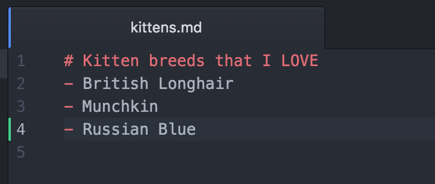
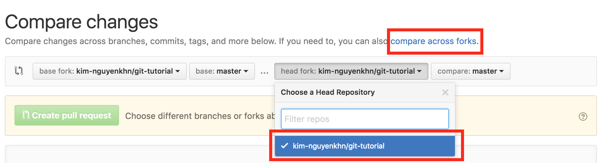

# git-tutorial
Basic tutorial &amp; practice environment for first time git-users.

## Instructions

```
tldr;
1. Fork the repo into your profile.
2. Clone your own fork in your terminal window.
3. Open kittens.md & make changes.
4. Create a new Pull Request (PR) to merge your changes into kim-nguyenkhn/git-tutorial.
```

#### 1. Forking


#### 2. Cloning


#### 3. Making changes



#### 4. Creating a Pull Request



