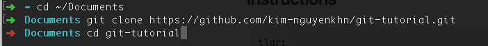

# git-tutorial
Basic tutorial &amp; practice environment for first time git-users.


## Pre-Setup

1. Make sure you have [Git installed](https://git-scm.com/book/en/v2/Getting-Started-Installing-Git) on your computer.
2. And of course, make sure you have a [registered GitHub account](https://github.com/join?source=header-home).


## Instructions

```
tldr;
1. Fork the repo into your profile.
2. Clone your own fork in your terminal window.
3. Open kittens.md & make changes.
4. Commit & push your changes.
5. Create a new Pull Request (PR) to merge your changes into kim-nguyenkhn/git-tutorial.
```

Use the **[Git Cheat Sheet](https://www.git-tower.com/blog/git-cheat-sheet/)** here if you don't remember the commands.

### 1. Forking

<kbd></kbd>

**[Fork the repository.](https://help.github.com/articles/fork-a-repo/)** This creates an exact copy of the "git-tutorial" repository into your own profile. After forking, you should be able to view it from your profile's list of repositories.


### 2. Cloning

<kbd></kbd>

<kbd></kbd>

**[Clone the repository.](https://git-scm.com/book/en/v2/Git-Basics-Getting-a-Git-Repository#Cloning-an-Existing-Repository)** This command puts a copy of the Git repository onto your local machine, so you can work with it.

```bash
cd ~/Documents
git clone <YOUR_FORK_HTTPS_GIT_URL_HERE>
```


### 3. Making changes

<kbd></kbd>

<kbd></kbd>

Download [Atom](https://atom.io/) or [Sublime Text](https://sublimetext.com/3) for free. Open `kittens.md` and make your changes.


### 4. Committing & Pushing

<kbd></kbd>

<kbd></kbd>

<kbd></kbd>

Use the commands below to verify & publish your changes.

```bash
git diff                                (Shows local changes to tracked files)
git add <file>                          (Adds/stages a file to the next commit)
git commit -m "some commit message"     (Commits previously staged changes)
git push                                (Publish local changes into your fork)
```


### 5. Creating a Pull Request

<kbd></kbd>

<kbd></kbd>

Click **["New Pull Request"]**(https://github.com/kim-nguyenkhn/git-tutorial/compare?expand=1). Click "Compare Across Forks". Select your fork from the dropdown.

Click the big green "Create Pull Request" button to finish. From there, I'll merge the PR and you should see your resulting changes in **[kittens.md](kittens.md)**.
